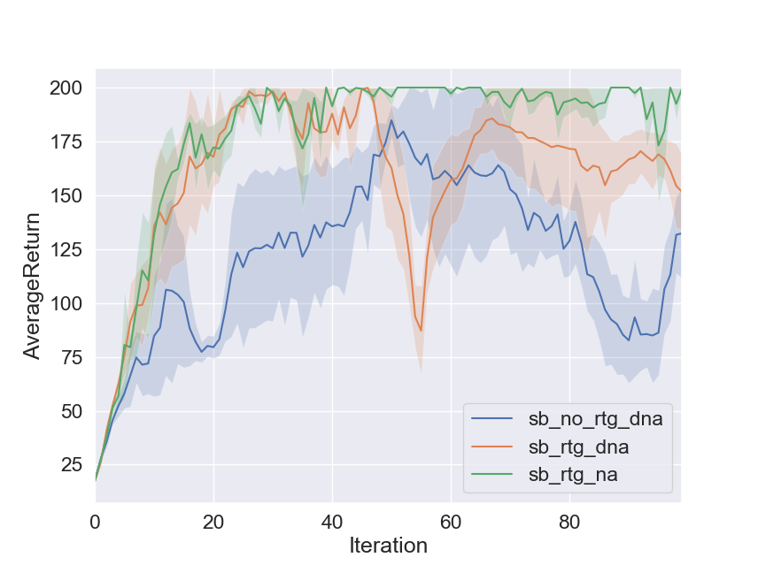
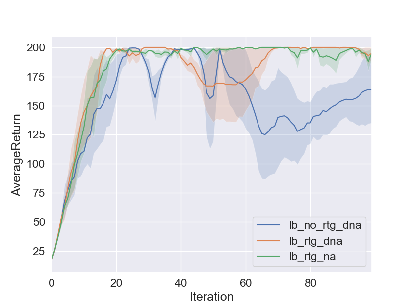

### Problem 1

#### Answer to (a):

$$
\begin{align}
&\quad\sum_{t=1}^T\mathbb E_{\tau\sim p_\theta(\tau)}[\nabla_\theta\log\pi_\theta(a_t|s_t)b(s_t)]\\
&=\sum_{t=1}^T\mathbb E_{\tau/s_t,a_t}\big[\mathbb E_{s_t,a_t}[\nabla_\theta\log\pi_\theta(a_t|s_t)b(s_t)]\big]\\
&=\sum_{t=1}^T\mathbb E_{\tau/s_t,a_t}\Big[\mathbb E_{s_t}\big[b(s_t)\mathbb E_{a_t}[\nabla_\theta\log\pi_\theta(a_t|s_t)]\big]\Big]\\
&=\sum_{t=1}^T\mathbb E_{\tau/s_t,a_t}\left[\mathbb E_{s_t}\left[b(s_t)\mathbb \int\nabla_\theta\log\pi_\theta(a_t|s_t)\pi_\theta(a_t|s_t)da_t\right]\right]\\
&=\sum_{t=1}^T\mathbb E_{\tau/s_t,a_t}\left[\mathbb E_{s_t}\left[b(s_t)\mathbb \nabla_\theta\int\pi_\theta(a_t|s_t)da_t\right]\right]\\
&=\sum_{t=1}^T\mathbb E_{\tau/s_t,a_t}\left[\mathbb E_{s_t}\left[b(s_t)\mathbb \nabla_\theta1\right]\right]\\
&=0
\end{align}
$$

#### Answer to (b)

(a): This is because of the Markov property of MDP, which states that the conditional probability distribution of future states of the process depends only upon the present state, no on the sequence of eventsthat preceded it.

(b):
$$
\begin{align}
&\quad\sum_{t=1}^T\mathbb E_{\tau\sim p_\theta(\tau)}[\nabla_\theta\log\pi_\theta(a_t|s_t)b(s_t)]\\
&=\sum_{t=1}^T\mathbb E_{(s_{1:t}, a_{1:t-1})}\left[b(s_t)\mathbb E_{a_t}\left[\nabla_\theta\log\pi_\theta(a_t|s_t)\mathbb E_{s_{t+1:T}, a_{t+1:T}}[1]\right]\right]\\
&=\sum_{t=1}^T\mathbb E_{(s_{1:t}, a_{1:t-1})}\left[b(s_t)\mathbb E_{a_t}\left[\nabla_\theta\log\pi_\theta(a_t|s_t)\right]\right]\\
&=0
\end{align}
$$

## Problem 4

### Small batch experiment results



### Large batch experiment results



### Answers to Questions

The one with both reward-to-go and advantage-centering performs best.

Advantage centering does not seem to speed up learning process, but it does help stablize the process after reaching the optimal behavior 

```shell
python train_pg_f18.py CartPole-v0 -n 100 -b 1000 -e 3 -rtg --exp_name sb_rtg_na
```

